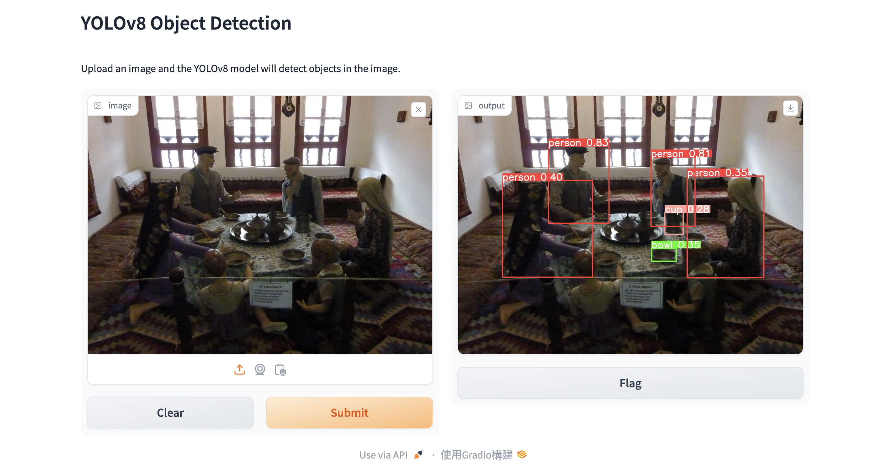

# Image Detection Web Application
This server platform integrates both front-end and back-end technologies and is primarily designed to identify and locate people in images. The project is developed in Python and utilizes the Gradio package to create a user-friendly web interface. With the YOLOv8 model, our application can quickly and accurately detect people in images.



## How to use
1. Access the Application
   - Run the frontend and backend servers first, then access the URL http://127.0.0.1:7860
2. Upload an Image
   - In the input section on the left side of the web page, click the upload button to select the image you want to detect.
3. Submit the Image
   - After selecting the image, click the "submit" button to send the image for processing. The system will then detect the people in the image.
4. View Results
   - Once processing is complete, the output section on the right will display the detected objects. Meanwhile, the location information of detected objects will be saved in the "backend" directory.


## Download the repositiry
```bash
git clone https://github.com/CCYehTaiwan/IdeasLab.git
```

## Architecture Overview
```bash
|---IdeasLab
     |---backend
          |---main.py
          |---yolo_inference.py
          |---save_data.py
     |---frontend
          |---app.py
     |---.gitignore
     |---README.md
     |---requirement.txt

```
- The system architecture is divided into two parts:
  - Frontend: Executes app.py, which initiates the Gradio interface.
  - Backend: Runs main, starting up the server at http://127.0.0.1:7860.
- Frontend Operations:
  - Creates a binary stream in memory to store input images before sending HTTP request to the backend.
- Backend Operations:
  - Pre-loads the YOLOv8 model upon server startup to avoid repetitive loading during subsequent requests.
  - PNG, JPG, or JPEG are required for processing.
  - Performs image detection on valid files.
  - Stores detection information in a JSON file.
  - Returns images with visual markers indicating detected locations.


## Setup virtual environment
It is recommended to install Python 3.10.X for other package installation.
```bash
python3 -m venv your_virtual_name
source your_virtual_name/bin/activate
```

## Intall required packages
```bash
pip install -r requirement.txt
```

## Running the server

1. Start the frontend server
   ```bash
   python3 app.py
   ```
2. Start the backend server
   ```bash
   uvicorn main:app --reload
   ```
3. Open a web browser and access the URL http://127.0.0.1:7860/ to view the application.